# api.feedbackex

## TS Расширенная форма обратной связи (api.feedbackex)
   Расширенная форма обратной связи Битрикс  предназначена для отправки сообщений с сайта, включая скрытую защиту от спама, работу нескольких форм на одной странице, адаптивный шаблон, модальное окно, дополнительные поля и мн. другое.
   
*   Простота и удобство
*   Минимум настроек
*   Работает на аяксе без перезагрузки страницы
*   Легко встроить в любое модальное окно и дизайн сайта
*   Встроенное адаптивное модальное окно
*   У каждой формы свои стили, скрипты, идентификаторы
*   Скрытая защита от спама
*   Множество предустановленных полей
   
   Отлично подходит для большинства простых форм обратной связи, кинули компонент на страницу в визуальном редакторе, настроили и сохранили, все.
   Отличный, бесплатный и современный аналог стандартной формы обратной связи Битрикс!
   
   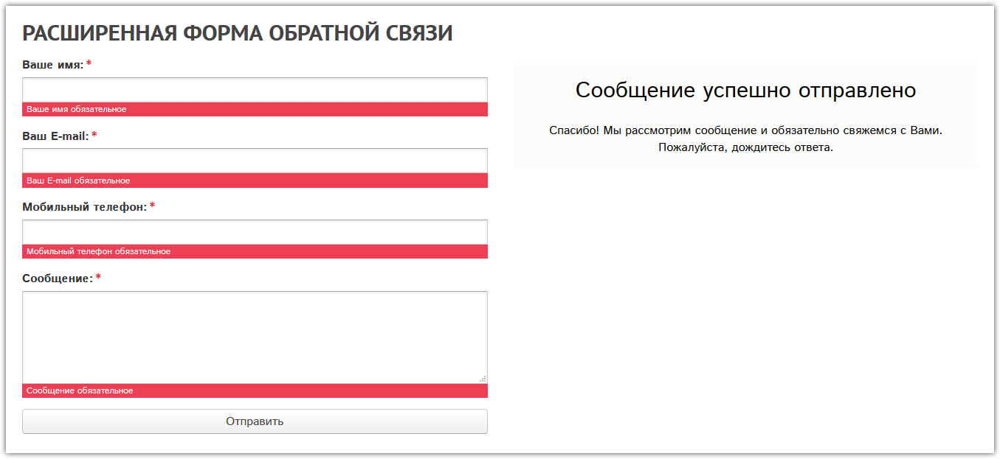
   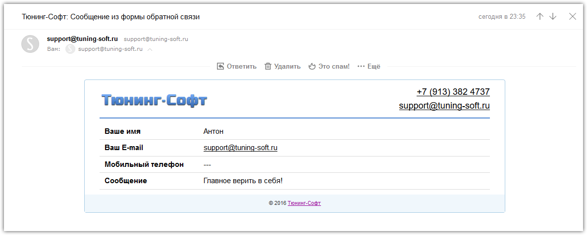
   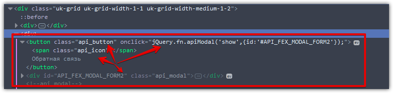
   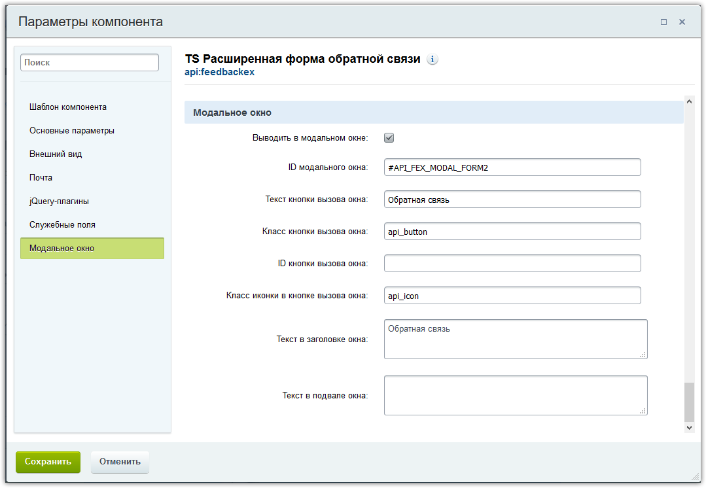
   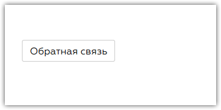
   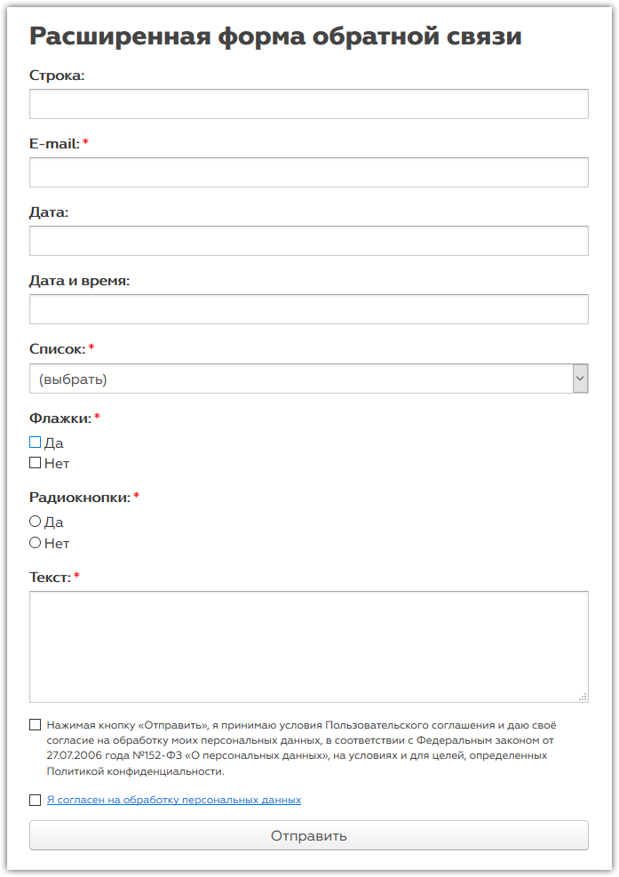
   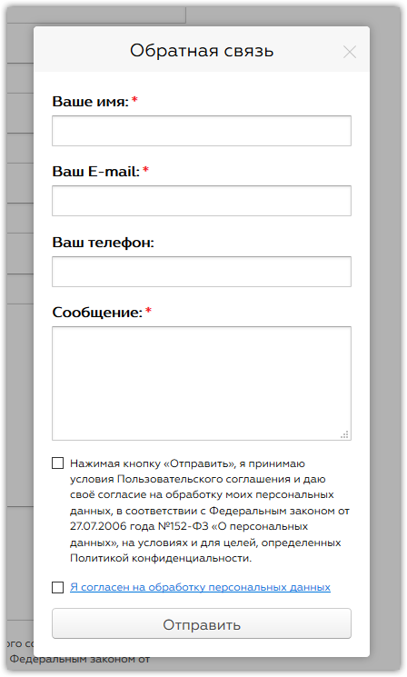
   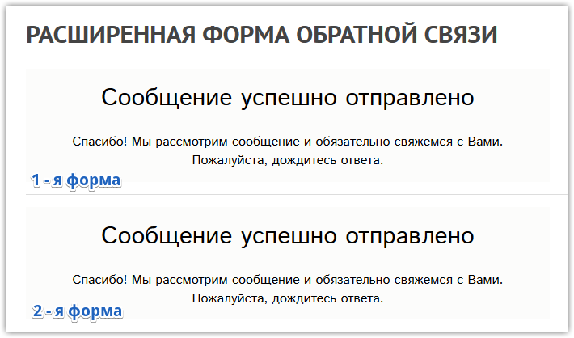
   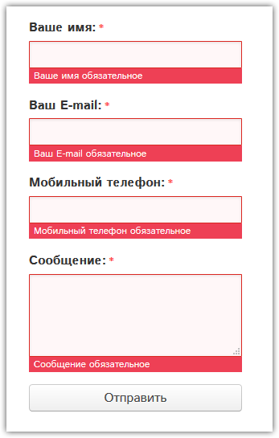
   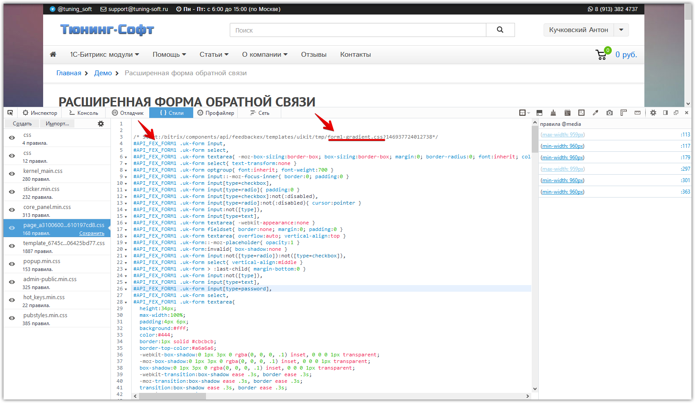
   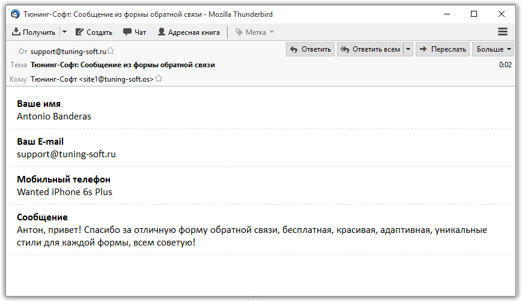
   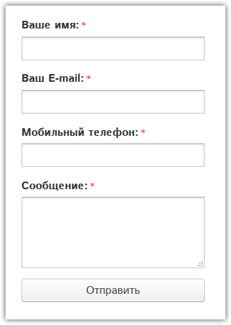
   